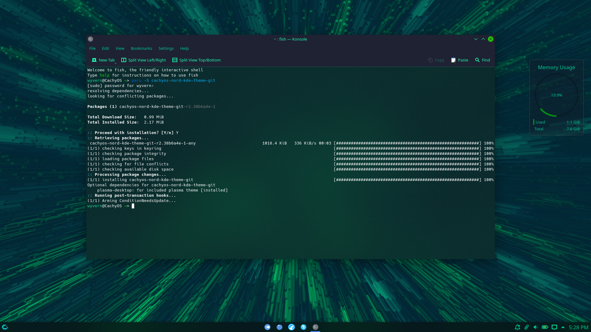
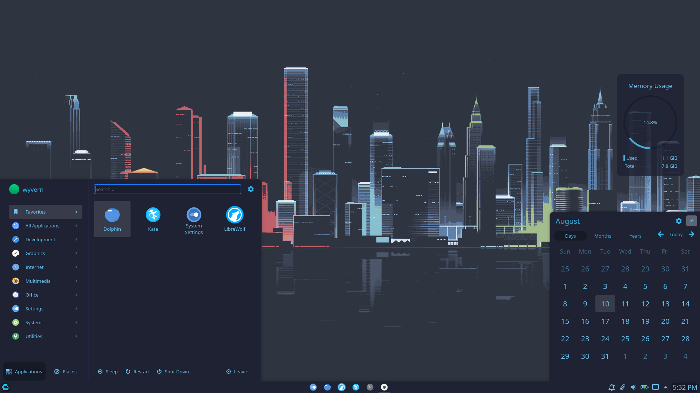
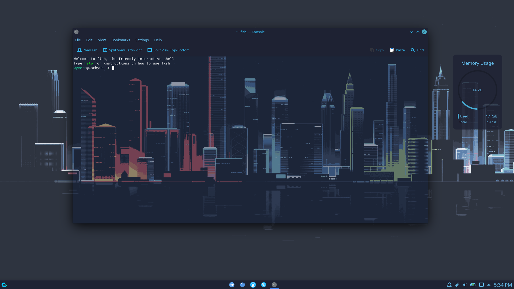
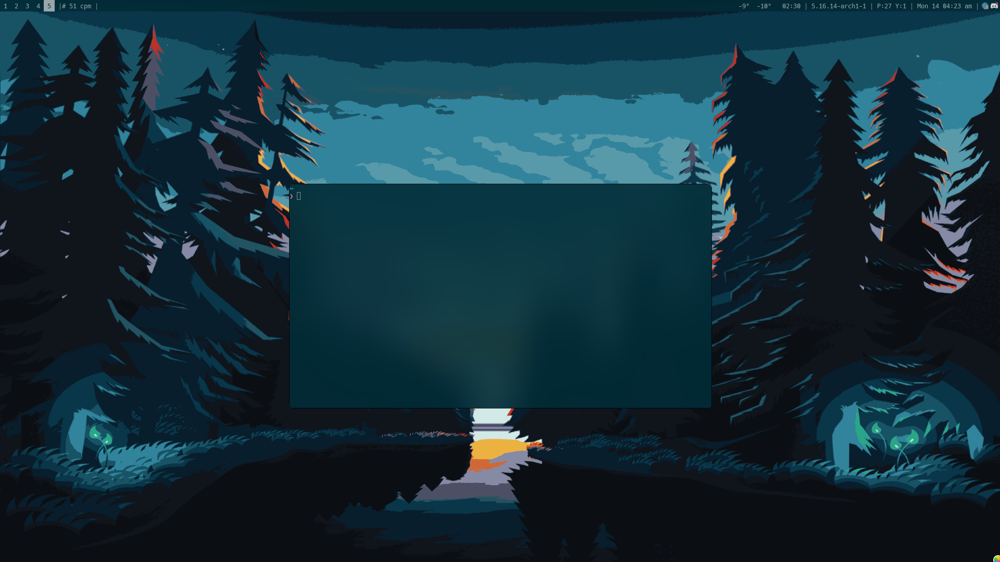
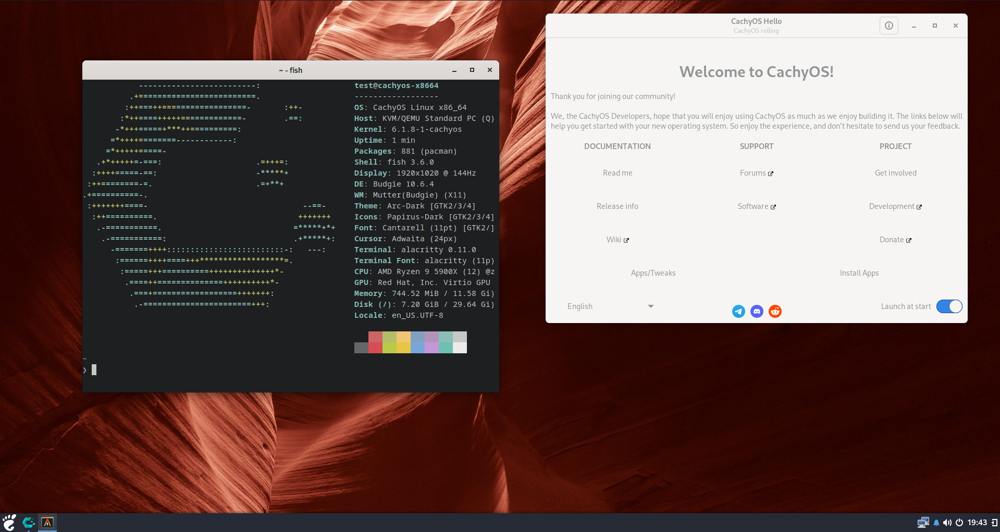

# CachyOS DE's Screenshots
## KDE
> Emerald Theme

> CachyOS Nord Theme

## Gnome

## i3

## XFCE

## CuteFish

## OpenBox

## LXQT

## Hyprland

## UKUI

## Cinnamon

## Budgie

## Mate

## LXDE

